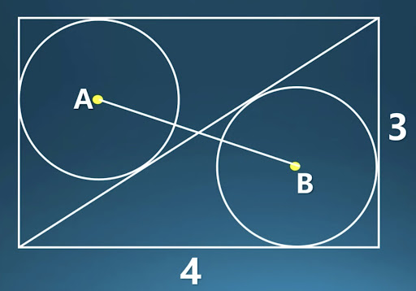

# 求AB长度

- Conversation ID: `68f440f1-2d14-8320-9950-726539d19154`

## Question



这里的4和3是长方形的边长。求AB的长度。

## Answer

把长方形左下角当作坐标原点，长边在 $x$ 方向长 4，高在 $y$ 方向长 3。对图中左侧圆和右侧圆分别设半径为 $r_1,r_2$。

左圆与左边和上边相切，中心为 $(r_1,\,3-r_1)$。右下到左上的对角线为直线 $y=\tfrac34x$，或写作 $3x-4y=0$。点到直线的距离等于半径（切线条件），于是

左圆：

```math
\dfrac{|3r_1-4(3-r_1)|}{\sqrt{3^2+(-4)^2}}=r_1
```

$\Rightarrow \dfrac{|7r_1-12|}{5}=r_1$ ，解得 $r_1=1$.

同理右圆中心为 $(4-r_2,\,r_2)$，代入距离公式得

```math
\dfrac{|3(4-r_2)-4r_2|}{5}=r_2
```

$\Rightarrow \dfrac{|12-7r_2|}{5}=r_2$，解得 $r_2=1$.

所以两圆心为 $A(1,2)$ 和 $B(3,1)$。因此

```math
AB=\sqrt{(3-1)^2+(1-2)^2}=\sqrt{4+1}=\sqrt5.
```

答案：$\boxed{\sqrt5}$。

