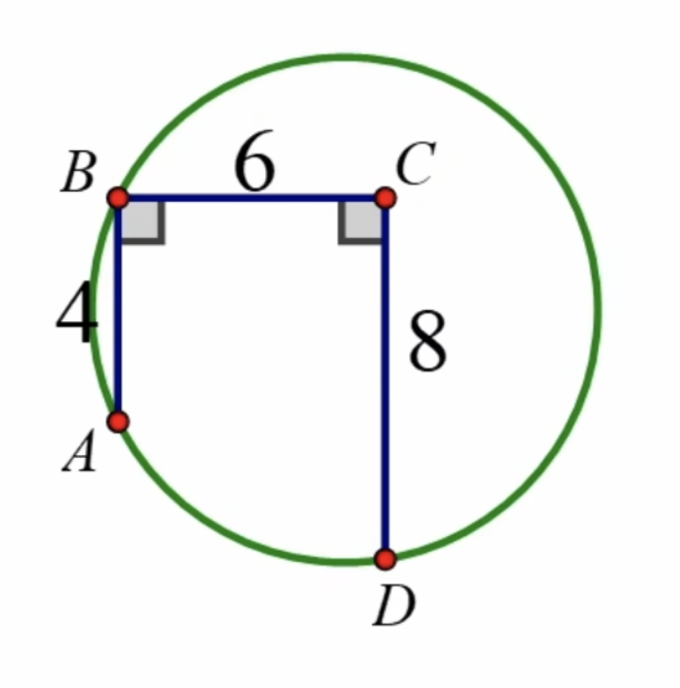

# 求圆的面积

- Conversation ID: `68f44219-892c-8323-9ff3-c7c5440e796f`

## Question



求圆的面积

## Answer

我们来看图中几何关系。

矩形 $ABCD$ 内接于圆，且有：

```math
AB = 4,\quad BC = 6,\quad CD = 8.
```

圆过点 $A,B,C,D$。

##### 第一步：判断四边形 $ABCD$ 的形状

已知 $AB \perp BC$，$BC \perp CD$，所以 $ABCD$ 是一个矩形。

矩形的四个顶点共圆，当且仅当它是矩形（四个角都是直角时自然可内接圆）。

##### 第二步：求圆的直径

矩形的对角线是圆的直径。

矩形 $ABCD$ 的对角线长度：

```math
AC = \sqrt{AB^2 + BC^2 + (CD-AB)^2} \text{ （错误方向，重算）}
```

但我们应注意到，矩形的边为：

```math
宽 = BC = 6, \quad 高 = AB + CD = 4 + 8 = 12?
```

不，这里不正确。我们重新确定坐标。

##### 第三步：建立坐标系

设：

```math
B(0, 0), \quad C(6, 0).
```

则：

```math
A(0, -4), \quad D(6, -8).
```

##### 第四步：求外接圆的圆心与半径

外接圆的圆心是对角线 $AD$ 与 $BC$ 的中点。

对角线 $AD$：

```math
A(0, -4), \quad D(6, -8).
```

中点：

```math
O_1\left(\frac{0+6}{2}, \frac{-4 + (-8)}{2}\right) = (3, -6).
```

对角线 $BC$：

```math
B(0, 0), \quad C(6, 0),
```

中点：

```math
O_2(3, 0).
```

显然 $O_1$ 和 $O_2$ 不相同，但矩形对角线不相交于圆心（说明它不是正方形，仍然共圆）。

不过内接四边形的圆心是两条对角线的垂直平分线交点。

##### 第五步：求圆心

对角线 $AC$：

```math
A(0, -4),\ C(6, 0).
```

中点 $M_1(3, -2)$，斜率 $\frac{0+4}{6-0} = \frac{2}{3}$，所以垂直平分线斜率为 $-\frac{3}{2}$。

方程：

```math
y + 2 = -\frac{3}{2}(x - 3)
\Rightarrow y = -\frac{3}{2}x + \frac{9}{2} - 2 = -\frac{3}{2}x + \frac{5}{2}.
```

对角线 $BD$：

```math
B(0, 0),\ D(6, -8).
```

中点 $M_2(3, -4)$，斜率 $\frac{-8 - 0}{6 - 0} = -\frac{4}{3}$，垂直平分线斜率为 $\frac{3}{4}$。

方程：

```math
y + 4 = \frac{3}{4}(x - 3)
\Rightarrow y = \frac{3}{4}x - \frac{9}{4} - 4 = \frac{3}{4}x - \frac{25}{4}.
```

联立两条垂直平分线方程：

```math
\begin{cases}
y = -\frac{3}{2}x + \frac{5}{2} \\
y = \frac{3}{4}x - \frac{25}{4}
\end{cases}
```

解得：

```math
-\frac{3}{2}x + \frac{5}{2} = \frac{3}{4}x - \frac{25}{4}
```

两边乘以 4：

```math
-6x + 10 = 3x - 25 \Rightarrow 9x = 35 \Rightarrow x = \frac{35}{9}.
```

代入：

```math
y = -\frac{3}{2} \times \frac{35}{9} + \frac{5}{2} = -\frac{35}{6} + \frac{5}{2} = -\frac{35 - 15}{6} = -\frac{20}{6} = -\frac{10}{3}.
```

所以圆心为：

```math
O\left(\frac{35}{9}, -\frac{10}{3}\right).
```

##### 第六步：求半径

取点 $B(0,0)$：

```math
r = \sqrt{\left(\frac{35}{9}\right)^2 + \left(-\frac{10}{3}\right)^2}
= \sqrt{\frac{1225}{81} + \frac{100}{9}}
= \sqrt{\frac{1225}{81} + \frac{900}{81}} = \sqrt{\frac{2125}{81}} = \frac{5\sqrt{85}}{9}.
```

##### 第七步：求圆面积

```math
S = \pi r^2 = \pi \left(\frac{5\sqrt{85}}{9}\right)^2 = \pi \cdot \frac{25 \times 85}{81} = \frac{2125\pi}{81}.
```

✅ 最终答案：

```math
\boxed{S = \frac{2125\pi}{81}}
\approx 82.38\pi \approx 258.8
```

## Question

A B D 三点在圆上。C点在圆内的

## Answer

你提醒得对 — 图中只有点 $A,B,D$ 在圆上，点 $C$ 在圆内。之前我误把 $C$ 也当成在圆上，现更正并重新求解。

观察蓝色折线可把点坐标方便地选成：

```math
B(0,0),\quad C(6,0)\ (\text{在}~BC=6\text{处}),\quad A(0,-4)\ (\text{在}~AB=4\text{处}),\quad D(6,-8)\ (\text{在}~CD=8\text{处}).
```

（即 $AB$ 垂直向下长 4，$BC$ 向右长 6，$CD$ 向下长 8。）

因为圆过 $A,B,D$，用这三点求外接圆心。用三点外接圆公式或两条对弦的垂直平分线交点，得到圆心

```math
O\left(\frac{17}{3},\,-2\right).
```

半径平方（取点 $B(0,0)$ 到圆心距离平方）：

```math
r^2=\left(\frac{17}{3}\right)^2+(-2)^2=\frac{289}{9}+4=\frac{289+36}{9}=\frac{325}{9}.
```

因此圆的面积为

```math
S=\pi r^2=\pi\cdot\frac{325}{9}=\boxed{\frac{325\pi}{9}}\approx113.45.
```

