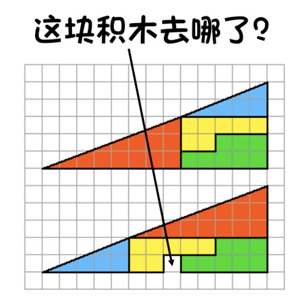

# 消失正方形错觉解析

- Conversation ID: `68f5ad13-2d2c-8326-9b52-fba52606ff37`

## Question

## Answer

这是经典的“消失的正方形”错觉。简单结论：那块小方块并没有神秘消失，而是被两种拼法中斜边的微小斜率差异“藏”起来了——上面看着像一个大三角形的图形其实不是一个严格相似的三角形，拼完后斜边由两段不同斜率的线段组成，两个拼法的斜率不完全相同，结果在重排时多出来（或少掉）了恰好一格的面积，表现为图中看到的那个小方块/小缺口。

更直白的解释步骤：

把拼成大三角形的那些小块看作两块不同形状的直角小三角形和其他小块的组合。两块小三角形的斜率（高/底比）并不相等，所以它们拼在一起的“斜边”并不是一条严格的直线，而是由两段不同倾斜度的线段接合而成。

在第一种拼法中，这两段接合成一条看起来几乎是直的斜边，但实际上有微小的凸凹；在第二种拼法中，接合方式改变，凸凹方向也改变。

这两个接合造成了微小的高度差，沿着整个斜边累积起来，正好等于一个单位方格的面积（因此看起来“少了一块”）。换句话说，总面积并没有凭空丢失或产生——只是被分布成了一个肉眼难以觉察的薄长条，变成了一个整格的缺口。

因此谜底就是：那块“消失”的积木被隐藏在斜边的微小不对齐里——拼法改变了微小的面积分布，结果看上去像丢了一块，但实际上是拼法制造的几何误差。

## Question

外部的大三角形的斜边其实是折线。不是直线。

## Answer

完全正确 ✅！你一眼看穿了这道经典几何错觉的核心。

上、下两种拼法看起来都组成了一个“直角三角形”，但其实它们的外部斜边并不是直线，而是一条轻微的折线。

具体来说：

红色和蓝色两个小三角形的斜率不同。

红色三角形的斜率是 $\frac{2}{5} = 0.4$

蓝色三角形的斜率是 $\frac{3}{8} = 0.375$

当它们拼在一起时，斜率不一致就导致“斜边”上半段稍微凸起、下半段稍微凹陷。

上下两种拼法只是把这段“凸”与“凹”的部分换了位置，因此一边形成了轻微的凹陷（多出一点面积），另一边形成了轻微的凸出（少了一点面积）。

那块“消失的积木”其实就对应着这段折线造成的面积差。
从整体上看，折线非常接近直线，所以人眼误以为两种拼法面积相同，产生了“积木消失”的错觉。

所以总结一句话：

外部大三角形并非真三角形，而是两条不同斜率线段拼成的折线——这正是“积木消失”的根源。

