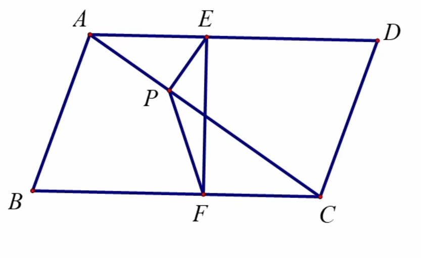

# 几何问题求解

- Conversation ID: `691133e4-8ef8-8330-b14c-100b45ac3ca4`

## Question



已知平行四边形ABCD，E,F分别为AD,BC上的点。连接EF，有EF \perp AD，且EF平分四边形ABCD的面积。
过E做EP\perp AC 于点P，连接PF。则\sin {\angle EFP}的最大值为多少？

## Answer

把题图放在坐标系里做。为简洁起见令 $AD$ 为水平、取单位长度 $AD=1$、并把高度缩放使得 $BC$ 到 $AD$ 的距离为 $1$。于是设

```math
A=(0,0),\quad D=(1,0),\quad B=(b,1),\quad C=(1+b,1).
```

设 $E$ 在 $AD$ 上，记 $E=(t,0)$（$0<t<1$）。由于 $EF\perp AD$，所以 $EF$ 是垂直线，故 $F$ 的横坐标也为 $t$，而 $F$ 在 $BC$ 上，故

```math
F=(t,1).
```

（1）由 $EF$ 平分平行四边形面积。平行四边形总面积为 $1\cdot 1=1$。把垂线 $x=t$ 与平行四边形左侧所包面积计算（对每一水平条长积分或直接观察）可得（在本参数范围内）

```math
\text{左面积}=t-\frac b2=\frac12,
```

因此

(1)

```math
b=2t-1.
```

（2）求点 $P$：$P$ 为点 $E=(t,0)$ 在对角线 $AC$ 上的垂足。向量 $AC=(1+b,1)$，把 $E$ 投影到 $AC$ 得

```math
P=\frac{E\cdot AC}{AC\cdot AC}\,AC.
```

代入（1） $b=2t-1$ 并展开，可得到（化简）：

```math
p_x-t=-\frac{t}{(1+b)^2+1},\qquad p_y-1=\text{某式}.
```

（3）计算 $\angle EFP$ 的正弦。注意在此坐标中 $FE=(0,-1)$（长度 1），向量 $FP=(p_x-t,p_y-1)$。于是

```math
\sin\angle EFP=\frac{|(FE)\times(FP)|}{|FE|\cdot|FP|=\;|FP|}=\frac{|p_x-t|}{\sqrt{(p_x-t)^2+(p_y-1)^2}}.
```

代入上面投影的显式表达并用 $b=2t-1$ 化简，得到

```math
\sin^2\angle EFP=\frac{t^2}{t^2+(2t^2+1)^2}.
```

（4）对 $t\in(0,1)$ 求最大值。令

```math
g(t)=\frac{t^2}{t^2+(2t^2+1)^2},
```

求导并解驻点，可得唯一的内部极值点满足 $2t^2-1=0$，即 $t=\tfrac{1}{\sqrt2}$。代入得

```math
\sin^2\angle EFP=\frac{1/2}{1/2+4}=\frac{1}{9},
```

所以

```math
\boxed{\max\sin\angle EFP=\frac{1}{3}.}
```

并且当 $t=\dfrac{1}{\sqrt2}$ 时达到（此时由 (1) 有 $b=2t-1=\sqrt2-1$）。

