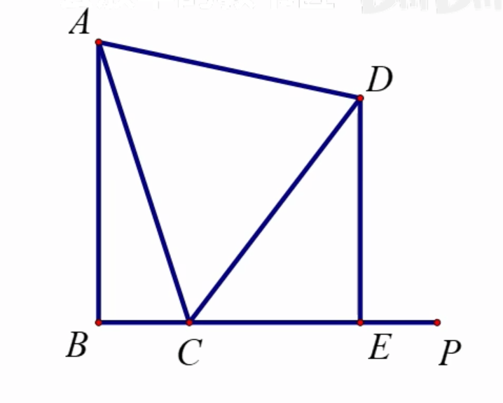

# 最大值求解

- Conversation ID: `690ecc0a-f2b0-8321-bf6b-8dd660acfd25`

## Question



如图，在四边形ABCD中。\angle ABC=90°，点C在射线BP上，\angle CAD=60°，且AC·AD=AB^2。过点D作DE \bot BP 于点E。 当AB=2时，求DE+\frac{\sqrt{3}}{3}BE 的最大值。

## Answer

把图放在坐标系中处理更方便。设 $B=(0,0)$，且已知 $AB=2$，因此取 $A=(0,2)$。射线 $BP$ 取为 $x$-轴，设
$C=(c,0)$（$c\ge0$），点 $E=(e,0)$，点 $D=(e,y)$（$y>0$）。所求量为

```math
F=DE+\frac{\sqrt3}{3}BE = y+\frac{\sqrt3}{3}e.
```

由题意 $\angle CAD=60^\circ$ 以及 $AC\cdot AD=AB^2=4$。向量表示：

```math
\overrightarrow{AC}=(c,-2),\qquad \overrightarrow{AD}=(e,y-2).
```

点积给出角度条件：

```math
\overrightarrow{AC}\cdot\overrightarrow{AD}=|AC||AD|\cos60^\circ=\tfrac12\cdot(AC)(AD)=2.
```

直接计算点积得

(1)

```math
ce-2(y-2)=2\quad\Rightarrow\quad ce=2y-2.
```

长度乘积条件平方化得

(2)

```math
(c^2+4)\big(e^2+(y-2)^2\big)=16.
```

用 (1) 解出 $c=\dfrac{2y-2}{e}$，代入 (2) 并整理（令 $X=e^2$）可得关于 $X$ 的二次方程

```math
X^2+(2y^2-6y+1)X+(y-1)^2(y-2)^2=0.
```

取较大的根（对应实际 $e^2$）得

```math
e^2 = -y^2+3y-\tfrac12+\tfrac12\sqrt{-12y^2+36y-15}.
```

注意判别式化简为

```math
-12y^2+36y-15=12\Big(1-(y-\tfrac32)^2\Big)\ge0,
```

所以 $y\in[\tfrac12,\tfrac52]$。

因此对于允许的 $y$，

```math
F(y)=y+\frac{\sqrt3}{3}\sqrt{ -y^2+3y-\tfrac12+\tfrac12\sqrt{-12y^2+36y-15}\ }.
```

对该函数求极大值（也可用解析法化简求导）得到极大值处

```math
y=\frac{3+\sqrt3}{2},
```

此时

```math
e^2=1+\frac{\sqrt3}{2},\quad e=\sqrt{1+\tfrac{\sqrt3}{2}}.
```

代回得最大值

```math
F_{\max}=y+\frac{\sqrt3}{3}e=2+\frac{2\sqrt3}{3}.
```

答：$\displaystyle \boxed{2+\frac{2\sqrt3}{3}}$。

