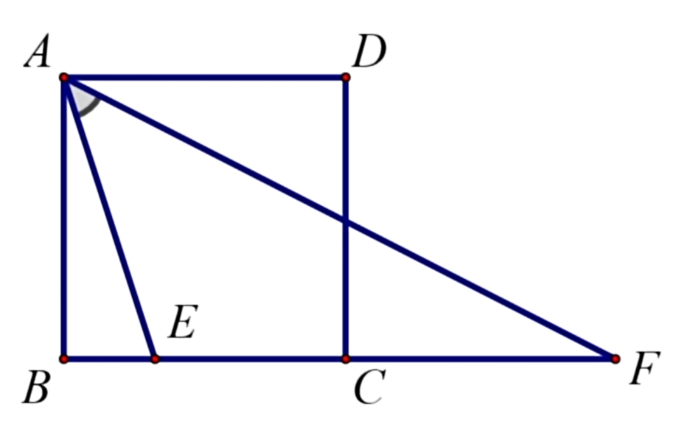

# 最大值求解

- Conversation ID: `6910be71-9b74-8327-9472-436d8751e33d`

## Question



在正方形ABCD中，点E,F在射线BC上运动，且\angle EAF=45°。求\frac{BE}{EF} 的最大值是多少

## Answer

设正方形边长为1，取坐标：$A(0,1),B(0,0),C(1,0),D(1,1)$。设点 $E(e,0),F(f,0)$（$0\le e<f$），由 $\angle EAF=45^\circ$，有

```math
\cos45^\circ=\frac{AE\cdot AF}{|AE||AF|}
=\frac{ef+1}{\sqrt{(e^2+1)(f^2+1)}}=\frac{\sqrt2}{2}.
```

平方并化简得

```math
2(ef+1)^2=(e^2+1)(f^2+1),
```

化为因式得

```math
(e f - e + f +1)(e f + e - f +1)=0.
```

由于需 $f\ge e$ 且 $0\le e<1$，排除第一因子，得到

```math
f=\frac{e+1}{1-e}.
```

于是要求的比值

```math
\frac{BE}{EF}=\frac{e}{f-e}=\frac{e(1-e)}{e^2+1}.
```

对 $e\in[0,1)$ 求极大值，令导数为0 得极值点

```math
e=\sqrt2-1.
```

代入得最大值

```math
\max\frac{BE}{EF}=\frac{e(1-e)}{e^2+1}\Big|_{e=\sqrt2-1}=\frac{\sqrt2-1}{2}.
```

答：最大值为 $\displaystyle\frac{\sqrt2-1}{2}$。

