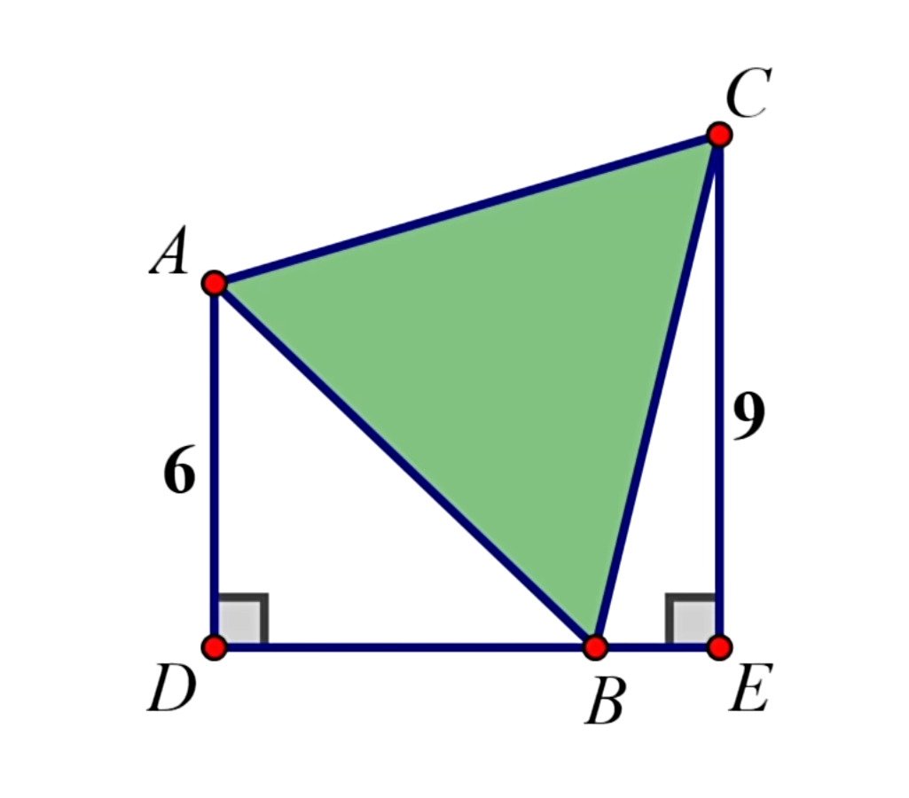

# 求线段AC长度

- Conversation ID: `6910b55d-8aac-8325-a290-a18a1a771bcc`

## Question



已知正三角形ABC，AD \perp DE，AD=6，CE=9，CE \perp DE 。求线段AC的长度。

## Answer

把底线 $DE$ 视为 $x$-轴，令点 $B=(0,0)$。设 $A(a,6)$、$C(c,9)$（因为 $AD\perp DE,\,AD=6$ 与 $CE\perp DE,\,CE=9$），则三角形 $ABC$ 为等边，故

```math
AB^2=BC^2=AC^2.
```

计算得

```math
AB^2=a^2+6^2=a^2+36,\qquad BC^2=c^2+9^2=c^2+81,
```

由 $AB^2=BC^2$ 得

(1)

```math
a^2+36=c^2+81\quad\Rightarrow\quad a^2-c^2=45.
```

又

```math
AC^2=(c-a)^2+(9-6)^2=(c-a)^2+9,
```

由 $AB^2=AC^2$ 得

(2)

```math
a^2+36=(c-a)^2+9\quad\Rightarrow\quad a^2=(c-a)^2-27.
```

令 $d=c-a$，由(1)(2)联立可解出 $d^2=75$。于是

```math
AC^2=d^2+9=75+9=84,
```

因此

```math
AC=\sqrt{84}=2\sqrt{21}.
```

答：$\;AC=2\sqrt{21}$。

