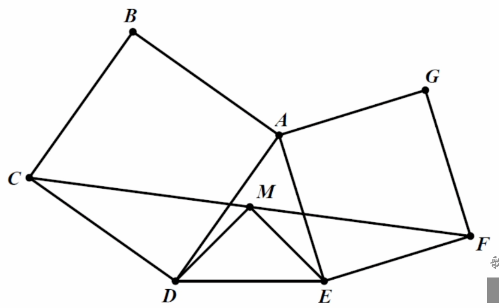

# 证明等腰直角三角形

- Conversation ID: `690ed04d-4a5c-8322-81b1-619c831cf468`

## Question



已知：ABCD与AEFG均为正方形，连接CF。取CF的中点M，连接DM,EM。
求证\triangle MDE为等腰直角三角形。

## Answer

把题意想清楚一点：题中每个正方形按顺时针或逆时针依次取顶点，所以 $A$ 与 $C$、$A$ 与 $F$ 是两个正方形的对顶点（见图中位置）。下面给出一个简洁的向量 / 坐标辅助的证明（也可做纯几何的同构三角形证明）。

设定坐标（只为便于运算，结论与坐标选取无关）
以 $D=(0,0)$, $E=(2,0)$ 为基点，取

```math
A=(1,a)
```

（$a>0$），使得左边正方形 $ABCD$ 的对顶点为 $A,C$，右边正方形 $AEFG$ 的对顶点为 $A,F$。对顶点的构造性质：若正方形一对对顶点为 $P,Q$，则另两顶点是把向量 $\overrightarrow{PQ}$ 旋转 $\pm90^\circ$ 并平移到合适位置得到的点。由此可以直接计算出

```math
C=(1-a,\;1+a),\qquad F=(1+a,\;1-a).
```

（这一组坐标来自于把以 $A$ 为一顶点、以对角线方向构造正方形的标准表达；重要的是 $C$ 与 $F$ 关于点 $(1,1)$ 对称，但不是关于 $A$ 对称——下面可直接算出中点不等于 $A$。）

所以

```math
C=(1-a,\,1+a),\quad F=(1+a,\,1-a).
```

中点

```math
M=\frac{C+F}{2}=\bigl(1,\;1\bigr).
```

另外我们已有 $D=(0,0),\;E=(2,0)$。于是可以直接计算向量

```math
\overrightarrow{MD}=D-M=(0,0)-(1,1)=(-1,-1),
```

```math
\overrightarrow{ME}=E-M=(2,0)-(1,1)=(1,-1).
```

检验：等长与直角

（1）等长：

```math
|\overrightarrow{MD}|=\sqrt{(-1)^2+(-1)^2}=\sqrt{2},\qquad
|\overrightarrow{ME}|=\sqrt{1^2+(-1)^2}=\sqrt{2}.
```

所以 $MD=ME$。

（2）直角（向量点积为 0）：

```math
\overrightarrow{MD}\cdot\overrightarrow{ME}=(-1)\cdot 1+(-1)\cdot(-1)=-1+1=0.
```

因此 $\angle DME=90^\circ$。

由此可得 $\triangle MDE$ 是等腰直角三角形（以 $MD=ME$ 为两条直角边）。

以上证明用了坐标和向量运算，计算简单直接。若要做纯几何证明，也可以用“把两个正方形的对顶点作映射与旋转对称”的性质来构造两个全等的直角等腰三角形，从而得到相同结论。

