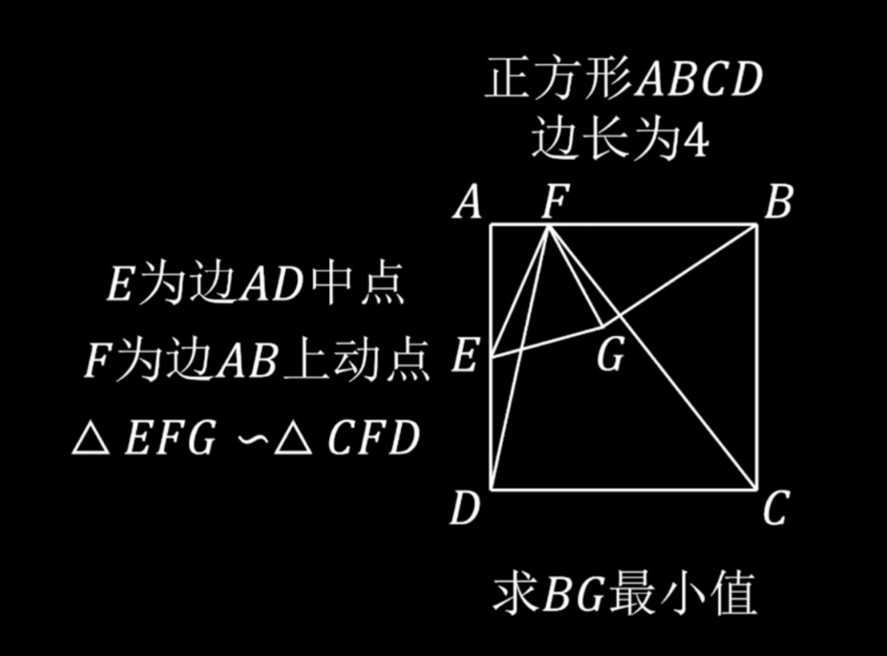

# BG最小值求解

- Conversation ID: `69ad9608-5e60-8333-88dc-2e402404e274`

## Question



## Answer

取图中那一支（即 $G$ 在正方形内部的那个相似位置）。设

```math
D(0,0),\ C(4,0),\ B(4,4),\ A(0,4),\ E(0,2),
```

并令

```math
F(t,4),\qquad 0\le t\le 4.
```

我们要求 $BG$ 的最小值。

#### 1. 用相似变换写出 $G$

把平面看成复平面，记点的复数坐标仍为同样字母，则

```math
D=0,\quad C=4,\quad B=4+4i,\quad A=4i,\quad E=2i,\quad F=t+4i.
```

因为 $\triangle EFG\sim \triangle CFD$，且取图中所示那一支，所以这是一个反向相似。
因此存在复数 $\lambda$，使得

```math
E-F=\lambda\,\overline{(C-F)},\qquad G-F=\lambda\,\overline{(D-F)}.
```

先算出

```math
E-F=-t-2i,\qquad \overline{(C-F)}=4-t+4i,\qquad \overline{(D-F)}=-t+4i.
```

于是

```math
\lambda=\frac{-t-2i}{\,4-t+4i\,},
```

从而

```math
G
=F+\lambda\,\overline{(D-F)}
=t+4i+\frac{(-t-2i)(-t+4i)}{4-t+4i}.
```

化简得

```math
G=
\frac{-4t^2+16t+32}{t^2-8t+32}
+i\frac{2t^2-40t+96}{t^2-8t+32}.
```

所以

```math
x_G=\frac{-4t^2+16t+32}{t^2-8t+32},\qquad
y_G=\frac{2t^2-40t+96}{t^2-8t+32}.
```

#### 2. 写出 $BG^2$

```math
BG^2=(x_G-4)^2+(y_G-4)^2.
```

代入上式整理：

```math
BG^2=\frac{4(17t^2-48t+80)}{t^2-8t+32}.
```

注意到

```math
t^2-8t+32=(t-4)^2+16\gt{}0,
```

所以分母恒正。

#### 3. 求这个分式的最小值

设

```math
BG^2\ge m.
```

因为分母恒正，这等价于

```math
4(17t^2-48t+80)-m(t^2-8t+32)\ge 0,
```

即

```math
(68-m)t^2+(-192+8m)t+(320-32m)\ge 0.
```

若要它对所有 $t$ 都成立，则这个二次式的判别式必须不大于 0：

```math
(-192+8m)^2-4(68-m)(320-32m)\le 0.
```

化简：

```math
m^2-108m+784\le 0.
```

于是

```math
54-2\sqrt{533}\le m\le 54+2\sqrt{533}.
```

因此 $BG^2$ 的最小值就是这个区间的左端点：

```math
\min BG^2=54-2\sqrt{533}.
```

所以

```math
\boxed{BG_{\min}=\sqrt{54-2\sqrt{533}}}.
```

数值约为

```math
\boxed{BG_{\min}\approx 2.79757 }.
```

#### 4. 取等时的 $F$

取等时判别式为 0，于是

```math
t=\frac{58-2\sqrt{533}}{11}.
```

也就是说，当

```math
AF=\frac{58-2\sqrt{533}}{11}
```

时，$BG$ 取得最小值。

最终答案：

```math
\boxed{BG_{\min}=\sqrt{54-2\sqrt{533}} }.
```

如果你想要，我也可以把这题改写成不用复数、只用解析几何与三角函数的解法。

## Question

可以化简为： \sqrt{41} - \sqrt{13}

## Answer

对，可以。

因为

```math
\left(\sqrt{41}-\sqrt{13}\right)^2
=41+13-2\sqrt{41\cdot 13}
=54-2\sqrt{533}.
```

而我们已经得到

```math
BG_{\min}=\sqrt{54-2\sqrt{533}}.
```

所以

```math
BG_{\min}=\sqrt{41}-\sqrt{13},
```

这里取正号是因为 $\sqrt{41}>\sqrt{13}$，故差为正。

因此最终可化简为

```math
\boxed{BG_{\min}=\sqrt{41}-\sqrt{13}}.
```

我上一步没有继续做这个二次根式拆分，这里你这个化简是正确的。

