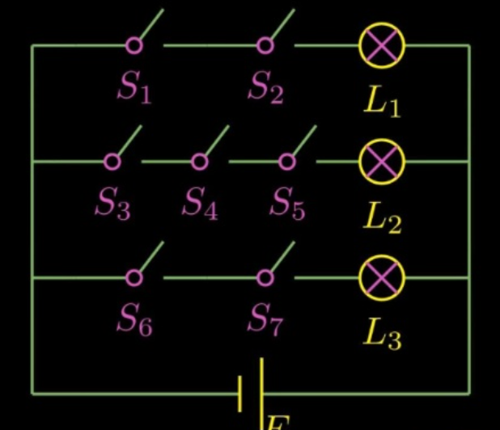

# L1最先亮起概率

- Conversation ID: `69a52c46-366c-8332-b764-ee66fc912d31`

## Question



如图电路中，$S_i \ (i = 1, 2, 3, 4, 5, 6, 7)$ 为未闭合的开关，$L_j \ (j = 1, 2, 3)$ 是能正常工作的灯泡，现每次等可能的闭合一个未闭合的开关，直到 $7$ 个开关全部闭合，则 $L_1$ 最先亮起的概率是多少？

## Answer

把“每次等可能闭合一个未闭合开关直到全闭合”看成：7 个开关的闭合顺序是一条等可能的随机排列（每个排列概率 $1/7!$）。

三盏灯点亮条件（并联支路互不影响）：

$L_1$ 亮 $\iff S_1,S_2$ 都闭合（两开关串联）

$L_2$ 亮 $\iff S_3,S_4,S_5$ 都闭合（三开关串联）

$L_3$ 亮 $\iff S_6,S_7$ 都闭合（两开关串联）

设 $T_1,T_2,T_3$ 分别为三盏灯首次亮起的步数。由于一次只闭合一个开关，不会出现并列“同时第一次亮”。

我们要求

```math
\mathbb P(T_1\lt{}T_2,\ T_1\lt{}T_3).
```

#### 1) 先条件化在 $T_1=t$

$T_1$ 就是 $S_1,S_2$ 在排列中出现位置的较大者。两位置从 $\{1,\dots,7\}$ 中任选两点，等可能，共 $\binom72=21$ 种，因此

```math
\mathbb P(T_1=t)=\frac{t-1}{21}\qquad (t=2,3,\dots,7).
```

在给定 $T_1=t$ 时，前 $t$ 步里除了 $S_1,S_2$ 占去 2 个位置外，其余 $k=t-2$ 个位置由剩下 5 个开关

```math
\{S_3,S_4,S_5,S_6,S_7\}
```

等可能地抽取一个大小为 $k$ 的子集填入（只看“出现了哪些”，不看顺序）。

要使 $L_1$ 最先亮，则在第 $t$ 步 $L_1$ 刚亮时，$L_2$ 与 $L_3$ 都还没亮，即：

前 $t$ 步中不能已经包含 $S_3,S_4,S_5$ 全部（否则 $L_2$ 更早亮）；

前 $t$ 步中不能已经包含 $S_6,S_7$ 全部（否则 $L_3$ 更早亮）。

也就是：这个大小为 $k$ 的子集不能“含全三 $B$”也不能“含全二 $C$”。

#### 2) 逐个 $t$ 计数（只需到 $t=5$）

记 $k=t-2$，总子集数 $\binom5k$。

$t=2\Rightarrow k=0$：必然没凑齐 $B$ 或 $C$，条件概率 $1$。

$t=3\Rightarrow k=1$：同理，条件概率 $1$。

$t=4\Rightarrow k=2$：唯一会让 $L_3$ 已亮的是子集 $\{S_6,S_7\}$（1 个坏），所以

```math
\mathbb P(\text{成功}\mid T_1=4)=\frac{\binom52-1}{\binom52}=\frac{9}{10}.
```

$t=5\Rightarrow k=3$：坏子集分两类

含全 $S_3,S_4,S_5$：只有 $\{S_3,S_4,S_5\}$（1 个坏）；

含全 $S_6,S_7$：再从 $\{S_3,S_4,S_5\}$ 里选 1 个，共 $\binom31=3$ 个坏。
所以好子集 $= \binom53-(1+3)=10-4=6$，

```math
\mathbb P(\text{成功}\mid T_1=5)=\frac{6}{10}=\frac35.
```

$t\ge 6$：此时前 $t$ 步里已经出现了 5 个“非 $S_1,S_2$”开关中的至少 4 个，必然已经凑齐“三个 $B$”或“两 个 $C$”之一，从而 $L_2$ 或 $L_3$ 早已点亮，因此条件概率为 0。

#### 3) 汇总

```math
\begin{aligned}
\mathbb P(L_1\text{最先亮})
&=\sum_{t=2}^5 \mathbb P(T_1=t)\,\mathbb P(\text{成功}\mid T_1=t)\\
&=\frac{1}{21}\cdot 1+\frac{2}{21}\cdot 1+\frac{3}{21}\cdot\frac{9}{10}+\frac{4}{21}\cdot\frac35\\
&=\frac{3}{21}+\frac{9}{70}+\frac{4}{35}
=\frac{10}{70}+\frac{9}{70}+\frac{8}{70}
=\boxed{\frac{27}{70}}.
\end{aligned}
```

所以 $L_1$ 最先亮的概率是 $\boxed{27/70}\approx 0.3857$。

