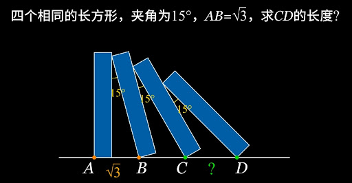

# 几何问题解析

- Conversation ID: `69abd64f-53e4-8330-95c0-a7188ed86dc4`

## Question



## Answer

设四个长方形的长为 $l$，宽为 $w$。

四个长方形的长边与地面的夹角依次为

```math
90^\circ,\ 75^\circ,\ 60^\circ,\ 45^\circ.
```

记

```math
AB=d_1,\quad BC=d_2,\quad CD=d_3.
```

已知 $d_1=AB=\sqrt3$。

对相邻两块长方形，观察“后一块的左上顶点”：

它都落在“前一块的右边”上。

于是，把“从前一块底点到后一块左上顶点”的位移，沿着垂直于前一块长边的方向投影，得到的长度恒等于长方形的宽 $w$。

#### 1. 从第1块到第2块

第1块长边与地面夹角为 $90^\circ$。

所以

```math
w=AB\sin90^\circ+l\sin15^\circ.
```

即

```math
w=d_1+l\sin15^\circ.
```

#### 2. 从第2块到第3块

第2块长边与地面夹角为 $75^\circ$。

同理

```math
w=BC\sin75^\circ+l\sin15^\circ.
```

即

```math
w=d_2\sin75^\circ+l\sin15^\circ.
```

#### 3. 从第3块到第4块

第3块长边与地面夹角为 $60^\circ$。

同理

```math
w=CD\sin60^\circ+l\sin15^\circ.
```

即

```math
w=d_3\sin60^\circ+l\sin15^\circ.
```

三式相等，消去 $w$ 和 $l\sin15^\circ$，得到

```math
d_1\sin90^\circ=d_2\sin75^\circ=d_3\sin60^\circ.
```

因此

```math
AB=d_1=d_3\sin60^\circ=CD\cdot \frac{\sqrt3}{2}.
```

代入 $AB=\sqrt3$：

```math
\sqrt3=CD\cdot \frac{\sqrt3}{2}.
```

所以

```math
CD=2.
```

### 答案

```math
\boxed{2}
```

如果你愿意，我也可以给你画一个辅助线版本，这样一眼就能看出为什么要乘 $\sin90^\circ,\sin75^\circ,\sin60^\circ$。

