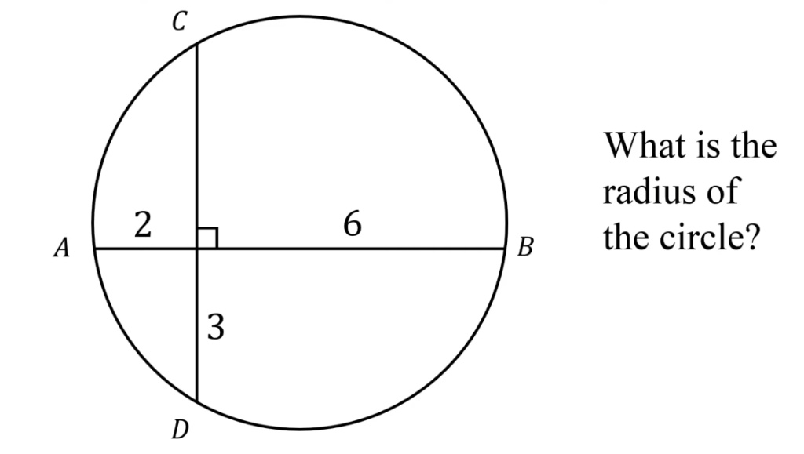

# 圆的半径求解

- Conversation ID: `69a528e0-1270-832a-a94a-f959b197f314`

## Question



请求出此圆的半径

## Answer

设两弦 $AB$ 与 $CD$ 在点 $E$ 处相交，且图中给出

```math
AE=2,\quad EB=6,\quad ED=3,\quad AB\perp CD.
```

##### 1) 先用弦交定理求 $EC$

弦交定理（内交弦幂定理）：

```math
AE\cdot EB = CE\cdot ED.
```

代入得

```math
2\cdot 6 = CE\cdot 3 \;\Rightarrow\; CE=4.
```

于是

```math
AB=2+6=8,\qquad CD=4+3=7.
```

##### 2) 用“圆心在弦的垂直平分线上”定位圆心

弦 $AB$ 的中点 $M$ 满足 $AM=MB=4$。因为 $AE=2, EB=6$，所以 $M$ 在 $E$ 的右侧 $2$ 个单位处。

弦 $CD$ 的中点 $N$ 满足 $CN=DN=3.5$。因为 $CE=4, ED=3$，所以 $N$ 在 $E$ 的上方 $0.5$ 个单位处。

圆心 $O$ 在两条弦的垂直平分线交点处。又因 $AB\perp CD$，所以：

$AB$ 的垂直平分线平行于 $CD$，过 $M$；

$CD$ 的垂直平分线平行于 $AB$，过 $N$；

两者交于 $O$。因此从点 $A$ 到点 $O$ 的水平、竖直差分别为

```math
\Delta x = 4,\qquad \Delta y = 0.5.
```

##### 3) 算半径

```math
r=OA=\sqrt{4^2+0.5^2}=\sqrt{16+\frac14}=\sqrt{\frac{65}{4}}=\frac{\sqrt{65}}{2}.
```

答案：圆的半径为 $\boxed{\dfrac{\sqrt{65}}{2}}$。

