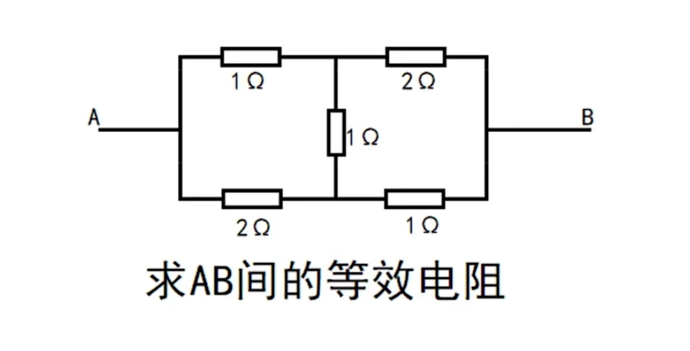

# 基尔霍夫定律应用

- Conversation ID: `699ef254-28f4-8329-a697-fde4fab74949`

## Question



物理题，考察基尔霍夫定律

## Answer

把 $B$ 端设为参考地（电势 $0$），在 $A$ 端加电压 $V$（即 $U_{AB}=V$）。

记上中节点电势为 $V_C$，下中节点电势为 $V_D$。电阻连接关系为：

$A\to C:1\Omega$，$C\to B:2\Omega$

$A\to D:2\Omega$，$D\to B:1\Omega$

```math
C\leftrightarrow D:1\Omega
```

对节点 $C,D$ 写基尔霍夫电流定律（KCL）：

##### 1）节点 $C$

```math
\frac{V_C-V}{1}+\frac{V_C-0}{2}+\frac{V_C-V_D}{1}=0
```

化简：

```math
(V_C-V)+\frac{V_C}{2}+(V_C-V_D)=0
\Rightarrow 5V_C-2V_D=2V
```

##### 2）节点 $D$

```math
\frac{V_D-V}{2}+\frac{V_D-0}{1}+\frac{V_D-V_C}{1}=0
```

化简：

```math
\frac{V_D-V}{2}+V_D+(V_D-V_C)=0
\Rightarrow 5V_D-2V_C=V
```

联立解得：

```math
V_C=\frac{4}{7}V,\qquad V_D=\frac{3}{7}V
```

##### 3）求从 $A$ 流出的总电流

从 $A$ 出去只有两条支路：

```math
I=\frac{V-V_C}{1}+\frac{V-V_D}{2}
= \left(V-\frac{4}{7}V\right)+\frac{V-\frac{3}{7}V}{2}
=\frac{3}{7}V+\frac{4}{7}V\cdot\frac12
=\frac{5}{7}V
```

所以等效电阻

```math
R_{AB}=\frac{V}{I}=\frac{V}{\frac{5}{7}V}=\frac{7}{5}\ \Omega=1.4\ \Omega
```

答案：$\boxed{R_{AB}= \tfrac{7}{5}\ \Omega}$.

