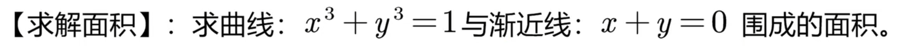

# 数学积分与曲线面积

- Conversation ID: `69ae1c66-f594-832b-aba8-c3b4a494974a`

## Question



## Answer

设

```math
u=x+y,\qquad v=x-y.
```

则

```math
x=\frac{u+v}{2},\qquad y=\frac{u-v}{2}.
```

先把曲线写到 $(u,v)$ 坐标下：

```math
x^3+y^3
=\left(\frac{u+v}{2}\right)^3+\left(\frac{u-v}{2}\right)^3
=\frac{(u+v)^3+(u-v)^3}{8}
=\frac{2u^3+6uv^2}{8}.
```

由 $x^3+y^3=1$ 得

```math
\frac{u^3+3uv^2}{4}=1
\quad\Longrightarrow\quad
u(u^2+3v^2)=4.
```

而题中的渐近线 $x+y=0$ 就是

```math
u=0.
```

所以在 $(u,v)$ 平面里，所求图形就是曲线

```math
u(u^2+3v^2)=4
```

与直线 $u=0$ 围成的区域。

由

```math
u(u^2+3v^2)=4
```

解出 $v^2$：

```math
v^2=\frac{4-u^3}{3u}.
```

为了有实点，必须 $u>0$ 且 $u^3\le 4$，所以

```math
0\lt{}u\le \sqrt[3]{4}.
```

于是该区域在 $(u,v)$ 平面中可写为

```math
0\lt{}u\le \sqrt[3]{4},\qquad
-\sqrt{\frac{4-u^3}{3u}}
\le v\le
\sqrt{\frac{4-u^3}{3u}}.
```

因此它在 $(u,v)$ 平面的面积为

```math
S_{uv}
=\int_0^{\sqrt[3]{4}}
2\sqrt{\frac{4-u^3}{3u}}\,du.
```

但我们要求的是 $(x,y)$ 平面中的面积。注意雅可比行列式：

```math
\frac{\partial(x,y)}{\partial(u,v)}
=
\begin{vmatrix}
\frac12 & \frac12\\[4pt]
\frac12 & -\frac12
\end{vmatrix}
=-\frac12,
```

故

```math
dx\,dy=\frac12\,du\,dv.
```

所以

```math
S=\frac12 S_{uv}
=\int_0^{\sqrt[3]{4}}
\sqrt{\frac{4-u^3}{3u}}\,du.
```

下面计算这个积分。

令

```math
u=\sqrt[3]{4}\,t\qquad (0\le t\le 1),
```

则 $du=\sqrt[3]{4}\,dt$，并且

```math
S
=\frac{4^{2/3}}{\sqrt3}\int_0^1 t^{-1/2}(1-t^3)^{1/2}\,dt.
```

再令

```math
s=t^3,\qquad t=s^{1/3},\qquad dt=\frac13 s^{-2/3}\,ds,
```

得

```math
S
=\frac{4^{2/3}}{3\sqrt3}\int_0^1 s^{-5/6}(1-s)^{1/2}\,ds.
```

这正是 Beta 函数：

```math
S
=\frac{4^{2/3}}{3\sqrt3}\,B\!\left(\frac16,\frac32\right).
```

于是

```math
\boxed{
S=\frac{4^{2/3}}{3\sqrt3}\,B\!\left(\frac16,\frac32\right)
}
```

这就是精确值。

若写成 Gamma 函数形式，可化为

```math
\boxed{
S=\frac{\sqrt3\,\Gamma\!\left(\frac13\right)^3}{4\pi}
}
```

数值约为

```math
\boxed{S\approx 2.6499581254}.
```

最终答案：

```math
\boxed{
\text{曲线 }x^3+y^3=1\text{ 与渐近线 }x+y=0\text{ 围成的面积 }
=
\frac{4^{2/3}}{3\sqrt3}B\!\left(\frac16,\frac32\right)
=
\frac{\sqrt3\,\Gamma(1/3)^3}{4\pi}
\approx 2.6499581254.
}
```

如果你愿意，我也可以继续给你写一个“不用坐标旋转、直接从

```math
\displaystyle \int_{-\infty}^{\infty}\bigl((1-x^3)^{1/3}+x\bigr)\,dx
```

出发”的解法。

