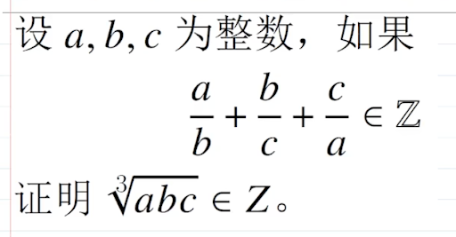

# 数学证明过程

- Conversation ID: `69abda43-fb64-832a-9ef3-3ec99da180f1`

## Question



## Answer

设

```math
\frac ab+\frac bc+\frac ca=n\in \mathbb Z,
```

其中 $a,b,c\in\mathbb Z\setminus\{0\}$。

要证 $\sqrt[3]{abc}\in\mathbb Z$，等价于证 $abc$ 是整数立方。
只需证明：对任意素数 $p$，$v_p(abc)$ 都是 $3$ 的倍数。

记

```math
v_p(a)=\alpha,\qquad v_p(b)=\beta,\qquad v_p(c)=\gamma.
```

则

```math
v_p(abc)=\alpha+\beta+\gamma.
```

由题设，

```math
\frac ab+\frac bc+\frac ca\in\mathbb Z
```

两边通分得

```math
\frac{a^2c+ab^2+bc^2}{abc}\in\mathbb Z,
```

所以

```math
abc\mid a^2c+ab^2+bc^2.
```

于是

(1)

```math
v_p(a^2c+ab^2+bc^2)\ge \alpha+\beta+\gamma.
```

现在看三项的 $p$-进赋值：

```math
v_p(a^2c)=2\alpha+\gamma,\qquad
v_p(ab^2)=\alpha+2\beta,\qquad
v_p(bc^2)=\beta+2\gamma.
```

#### 关键观察

若这三个数

```math
2\alpha+\gamma,\ \alpha+2\beta,\ \beta+2\gamma
```

中的最小值只出现一次，那么三项和的 $p$-进赋值就等于这个唯一最小值。
因此由 (1) 可知，这个唯一最小值必须 $\ge \alpha+\beta+\gamma$。

但注意

```math
(2\alpha+\gamma)-(\alpha+\beta+\gamma)=\alpha-\beta,
```

```math
(\alpha+2\beta)-(\alpha+\beta+\gamma)=\beta-\gamma,
```

```math
(\beta+2\gamma)-(\alpha+\beta+\gamma)=\gamma-\alpha.
```

而

```math
(\alpha-\beta)+(\beta-\gamma)+(\gamma-\alpha)=0.
```

所以这三个数 $\alpha-\beta,\beta-\gamma,\gamma-\alpha$ 不可能都 $>0$，故

```math
\min\{2\alpha+\gamma,\alpha+2\beta,\beta+2\gamma\}\le \alpha+\beta+\gamma.
```

若最小值只出现一次，就会与 (1) 矛盾。

因此，最小值至少出现两次。

#### 分类讨论

##### 情形 1

```math
2\alpha+\gamma=\alpha+2\beta\le \beta+2\gamma.
```

则

```math
\alpha+\gamma=2\beta,
```

从而

```math
\alpha+\beta+\gamma=3\beta.
```

##### 情形 2

```math
\alpha+2\beta=\beta+2\gamma\le 2\alpha+\gamma.
```

则

```math
\alpha+\beta=2\gamma,
```

从而

```math
\alpha+\beta+\gamma=3\gamma.
```

##### 情形 3

```math
\beta+2\gamma=2\alpha+\gamma\le \alpha+2\beta.
```

则

```math
\beta+\gamma=2\alpha,
```

从而

```math
\alpha+\beta+\gamma=3\alpha.
```

三种情形都得到

```math
\alpha+\beta+\gamma\equiv 0\pmod 3.
```

由于 $p$ 任意，所以对每个素数 $p$，都有

```math
v_p(abc)\equiv 0\pmod 3.
```

这说明 $abc$ 的每个素因子指数都是 $3$ 的倍数，故 $abc$ 是完全立方。

因此

```math
\sqrt[3]{abc}\in\mathbb Z.
```

证毕。

如果你愿意，我也可以再给你写一个更初等一些、尽量少用 $p$-进赋值符号的版本。

