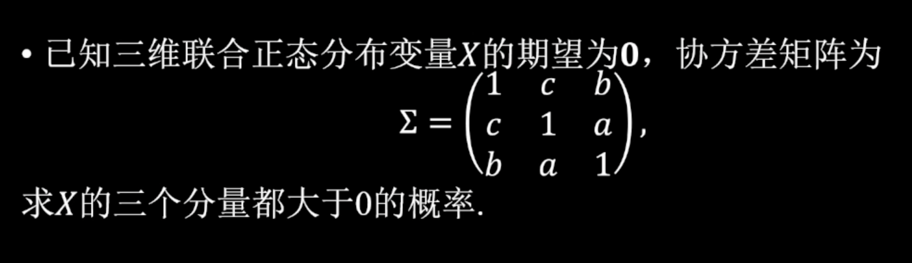

# 正态分布符号函数

- Conversation ID: `699ba4a7-bd84-832c-af88-91871ff48dcf`

## Question



## Answer

设 $X=(X_1,X_2,X_3)^\top\sim N(0,\Sigma)$，且

```math
\Sigma=\begin{pmatrix}
1&c&b\\
c&1&a\\
b&a&1
\end{pmatrix},
```

因为对角元都是 1，所以 $a,b,c$ 就是三对的相关系数：

```math
\rho_{12}=c,\ \rho_{13}=b,\ \rho_{23}=a
```

#### 1) 把“>0”写成符号函数

由于正态分布连续，$\mathbb P(X_i=0)=0$，有恒等式

```math
\mathbf 1_{\{X_i\gt{}0\}}=\frac{1+\mathrm{sgn}(X_i)}{2}.
```

因此

```math
p:=\mathbb P(X_1\gt{}0,X_2\gt{}0,X_3\gt{}0)
=\mathbb E\!\left[\prod_{i=1}^3 \frac{1+\mathrm{sgn}(X_i)}{2}\right]
=\frac18\,\mathbb E\!\left[\prod_{i=1}^3 (1+\mathrm{sgn}(X_i))\right].
```

展开得

```math
p=\frac18\Bigl(
1+\sum_{i}\mathbb E[\mathrm{sgn}(X_i)]
+\sum_{i\lt{}j}\mathbb E[\mathrm{sgn}(X_i)\mathrm{sgn}(X_j)]
+\mathbb E[\mathrm{sgn}(X_1)\mathrm{sgn}(X_2)\mathrm{sgn}(X_3)]
\Bigr).
```

其中：

$\mathbb E[\mathrm{sgn}(X_i)]=0$（因为 $X_i$ 关于 0 对称）。

最后三阶项为 0：因为 $X$ 与 $-X$ 同分布，而
$\mathrm{sgn}(-X_1)\mathrm{sgn}(-X_2)\mathrm{sgn}(-X_3)=-(\mathrm{sgn}X_1\mathrm{sgn}X_2\mathrm{sgn}X_3)$，故期望只能为 0。

所以

```math
p=\frac18\left(1+\sum_{i\lt{}j}\mathbb E[\mathrm{sgn}(X_i)\mathrm{sgn}(X_j)]\right).
```

#### 2) 二维引理：

```math
\mathbb E[\mathrm{sgn}X\,\mathrm{sgn}Y]=\dfrac{2}{\pi}\arcsin\rho
```

令 $(X,Y)$ 为零均值、方差 1、相关系数 $\rho$ 的二维正态。可表示为

```math
X=U,\qquad Y=\rho U+\sqrt{1-\rho^2}\,V,
```

其中 $U,V$ 独立标准正态。写成极坐标 $U=R\cos\theta,\ V=R\sin\theta$，则 $\theta$ 在 $[0,2\pi)$ 上均匀，且令 $\alpha=\arccos\rho$（$\cos\alpha=\rho,\ \sin\alpha=\sqrt{1-\rho^2}$），有

```math
Y=R(\rho\cos\theta+\sqrt{1-\rho^2}\sin\theta)=R\cos(\theta-\alpha).
```

因此事件 $\{X>0,Y>0\}$ 等价于 $\{\cos\theta>0,\ \cos(\theta-\alpha)>0\}$，这在圆周上对应两个长度为 $\pi$ 的开半圆弧的交，其长度为 $\pi-\alpha$。故

```math
\mathbb P(X\gt{}0,Y\gt{}0)=\frac{\pi-\alpha}{2\pi}
=\frac14+\frac{1}{2\pi}\arcsin\rho
\quad(\text{因 } \arcsin\rho=\tfrac{\pi}{2}-\alpha).
```

又因为 $\mathrm{sgn}X\,\mathrm{sgn}Y=1$ 当且仅当同号，且由对称性
$\mathbb P(\text{同号})=2\mathbb P(X>0,Y>0)$，于是

```math
\mathbb E[\mathrm{sgn}X\,\mathrm{sgn}Y]
=\mathbb P(\text{同号})-\mathbb P(\text{异号})
=2\mathbb P(\text{同号})-1
=4\mathbb P(X\gt{}0,Y\gt{}0)-1
=\frac{2}{\pi}\arcsin\rho.
```

#### 3) 回到三维

套用上式到三对 $(X_1,X_2),(X_1,X_3),(X_2,X_3)$，相关系数分别为 $c,b,a$，得到

```math
\mathbb E[\mathrm{sgn}(X_1)\mathrm{sgn}(X_2)]=\frac{2}{\pi}\arcsin c,\quad
\mathbb E[\mathrm{sgn}(X_1)\mathrm{sgn}(X_3)]=\frac{2}{\pi}\arcsin b,\quad
\mathbb E[\mathrm{sgn}(X_2)\mathrm{sgn}(X_3)]=\frac{2}{\pi}\arcsin a.
```

因此

```math
\boxed{\;
\mathbb P(X_1\gt{}0,X_2\gt{}0,X_3\gt{}0)
=\frac18+\frac{1}{4\pi}\Bigl(\arcsin a+\arcsin b+\arcsin c\Bigr).
\;}
```

当然前提是 $\Sigma$ 合法（半）正定：$|a|,|b|,|c|\le 1$ 且

```math
\det\Sigma=1+2abc-a^2-b^2-c^2\ge 0
```

