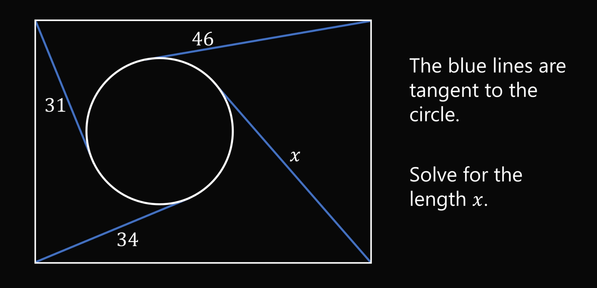

# 点的幂计算

- Conversation ID: `6988afc0-027c-8398-9fe8-ebfdf2f9b8e4`

## Question



## Answer

设矩形四个顶点依次为
$A(0,h)$（左上），$B(w,h)$（右上），$C(w,0)$（右下），$D(0,0)$（左下）。圆心为 $O(a,b)$，半径 $r$。

从点 $P$ 向圆作切线，切线段长 $t_P$ 满足点的幂：

```math
t_P^2=OP^2-r^2.
```

题中给出

```math
t_A=31,\quad t_B=46,\quad t_D=34,\quad t_C=x.
```

分别写出四个点的幂：

```math
\begin{aligned}
OA^2-r^2 &= 31^2,\\
OB^2-r^2 &= 46^2,\\
OD^2-r^2 &= 34^2,\\
OC^2-r^2 &= x^2.
\end{aligned}
```

注意到

```math
OA^2-OB^2=\big(a^2+(b-h)^2\big)-\big((a-w)^2+(b-h)^2\big)=a^2-(a-w)^2,
```

同理

```math
OD^2-OC^2=\big(a^2+b^2\big)-\big((a-w)^2+b^2\big)=a^2-(a-w)^2.
```

所以

```math
OA^2-OB^2=OD^2-OC^2.
```

把“幂”的等式代入（$r^2$ 会抵消）：

```math
(31^2-46^2)=(34^2-x^2).
```

计算：

```math
31^2-46^2=961-2116=-1155,\quad 34^2=1156,
```

于是

```math
-1155=1156-x^2 \;\Rightarrow\; x^2=2311 \;\Rightarrow\; x=\sqrt{2311}.
```

答案：$\boxed{x=\sqrt{2311}}\approx 48.07$.

