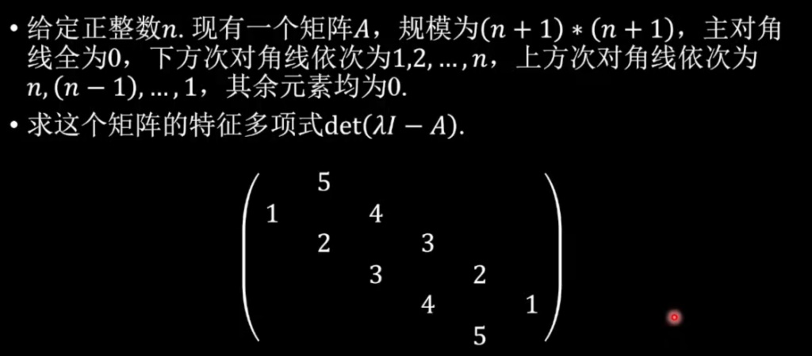

# 特征多项式求解

- Conversation ID: `69a52a01-24d0-8330-8b18-1b79e0b710ad`

## Question



## Answer

设矩阵 $A=(a_{ij})_{(n+1)\times(n+1)}$ 满足

```math
a_{i,i}=0,\qquad a_{i,i+1}=n+1-i,\qquad a_{i+1,i}=i\quad (i=1,\dots,n),
```

其余为 $0$。

注意 $\chi_A(\lambda)=\det(\lambda I-A)=\det(\lambda I-A^{\mathsf T})$，所以可研究 $A^{\mathsf T}$。

#### 1) 把 $A^{\mathsf T}$ 看成一个多项式空间上的线性算子

令

```math
V=\{f(x)\in\mathbb C[x]:\deg f\le n\},\quad \dim V=n+1,
```

取基 $1,x,x^2,\dots,x^n$。定义线性算子

```math
(Tf)(x)=(1-x^2)f'(x)+n x f(x).
```

对基向量 $x^k\ (k=0,\dots,n)$：

```math
T(x^k)=(1-x^2)\cdot kx^{k-1}+nx\cdot x^k
= kx^{k-1}+(n-k)x^{k+1}.
```

因此在基 $1,x,\dots,x^n$ 下，$T$ 的矩阵恰是 $A^{\mathsf T}$（上移系数为 $k$，下移系数为 $n-k$，主对角为 0）。
所以 $A$ 与 $T$ 有相同特征多项式。

#### 2) 构造 $n+1$ 个特征向量并得到全部特征值

对 $k=0,1,\dots,n$，令

```math
f_k(x)=(1+x)^k(1-x)^{\,n-k}.
```

计算对数导数：

```math
\frac{f_k'}{f_k}=\frac{k}{1+x}-\frac{n-k}{1-x}
=\frac{(2k-n)-nx}{1-x^2}.
```

于是

```math
(1-x^2)f_k'=\bigl((2k-n)-nx\bigr)f_k,
```

从而

```math
Tf_k=(1-x^2)f_k'+nx f_k=(2k-n)f_k.
```

所以 $f_k$ 是特征向量，对应特征值 $2k-n$。

这些 $f_k$ 线性无关（例如它们在 $x=-1$ 处的零点阶分别为 $k$，互不相同），因此 $T$（也就是 $A$）的全部特征值就是

```math
-n,\,-n+2,\,-n+4,\dots,\,n-2,\,n.
```

#### 3) 特征多项式

因此

```math
\boxed{\ \det(\lambda I-A)=\prod_{k=0}^{n}\bigl(\lambda-(2k-n)\bigr)
      \;=\;\prod_{k=0}^{n}\bigl(\lambda-(n-2k)\bigr)\ }.
```

按奇偶性可写成更“对称”的形式：

若 $n=2m$：

```math
\det(\lambda I-A)=\lambda\prod_{j=1}^{m}\bigl(\lambda^2-(2j)^2\bigr).
```

若 $n=2m+1$：

```math
\det(\lambda I-A)=\prod_{j=0}^{m}\bigl(\lambda^2-(2j+1)^2\bigr).
```

（例如图中 $n=5$：$(\lambda^2-1)(\lambda^2-9)(\lambda^2-25)$。）

