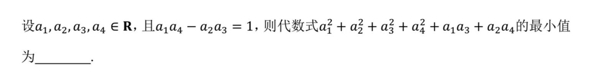

# 矩阵最小值求解

- Conversation ID: `69a875ca-cefc-8330-9b3b-33330fcee8bf`

## Question



## Answer

设列向量

```math
u=\binom{a_1}{a_3},\quad v=\binom{a_2}{a_4},\qquad \det[u\,v]=a_1a_4-a_2a_3=1.
```

令

```math
M=\begin{pmatrix}1&\tfrac12\\[2pt]\tfrac12&1\end{pmatrix}\;(\gt{}0),
```

则

```math
a_1^2+a_3^2+a_1a_3=u^{\!T}Mu,\qquad a_2^2+a_4^2+a_2a_4=v^{\!T}Mv,
```

所以目标函数

```math
F=u^{\!T}Mu+v^{\!T}Mv.
```

考虑矩阵 $B=[u\,v]$. 有

```math
B^{T}MB=\begin{pmatrix}u^{T}Mu&u^{T}Mv\\ v^{T}Mu&v^{T}Mv\end{pmatrix}.
```

取行列式：

```math
\det(B^{T}MB)=\det(B)^2\det(M)=1^2\cdot\Bigl(1-\tfrac14\Bigr)=\tfrac34.
```

而

```math
\det(B^{T}MB)=(u^{T}Mu)(v^{T}Mv)-(u^{T}Mv)^2\le (u^{T}Mu)(v^{T}Mv),
```

故

```math
(u^{T}Mu)(v^{T}Mv)\ge \tfrac34.
```

于是由 AM-GM

```math
F=u^{T}Mu+v^{T}Mv\ge 2\sqrt{(u^{T}Mu)(v^{T}Mv)}\ge 2\sqrt{\tfrac34}=\sqrt3.
```

因此最小值 $\ge \sqrt3$。

取

```math
a_1=a_4=-\sqrt{\frac{3+2\sqrt3}{6}},\qquad a_2=a_3=\sqrt{\frac{2\sqrt3-3}{6}},
```

则 $a_1a_4-a_2a_3=1$，且代入可得 $F=\sqrt3$，故下界可达。

最小值为 $\boxed{\sqrt3}$。

