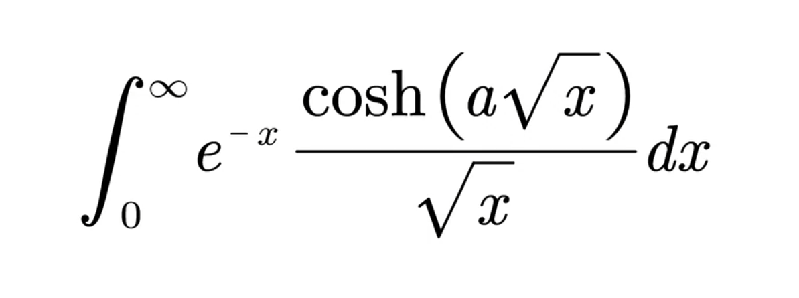

# 积分求解过程

- Conversation ID: `69ae1b90-eb80-8325-b716-59290fad0245`

## Question



## Answer

设

```math
I(a)=\int_0^\infty e^{-x}\frac{\cosh(a\sqrt{x})}{\sqrt{x}}\,dx .
```

作代换

```math
x=t^2,\qquad dx=2t\,dt,\qquad \sqrt{x}=t \quad (t\ge 0),
```

则

```math
I(a)=\int_0^\infty e^{-t^2}\frac{\cosh(at)}{t}\cdot 2t\,dt
=2\int_0^\infty e^{-t^2}\cosh(at)\,dt.
```

再用

```math
\cosh(at)=\frac{e^{at}+e^{-at}}{2},
```

得到

```math
I(a)=\int_0^\infty e^{-t^2+at}\,dt+\int_0^\infty e^{-t^2-at}\,dt.
```

第二项令 $u=-t$，则

```math
\int_0^\infty e^{-t^2-at}\,dt
=\int_{-\infty}^0 e^{-u^2+au}\,du.
```

所以两项相加为

```math
I(a)=\int_{-\infty}^{\infty} e^{-t^2+at}\,dt.
```

配方：

```math
-t^2+at
=-\left(t-\frac a2\right)^2+\frac{a^2}{4}.
```

于是

```math
I(a)=e^{a^2/4}\int_{-\infty}^{\infty} e^{-(t-a/2)^2}\,dt
=e^{a^2/4}\int_{-\infty}^{\infty} e^{-u^2}\,du
=\sqrt{\pi}\,e^{a^2/4}.
```

因此

```math
\boxed{\int_0^\infty e^{-x}\frac{\cosh(a\sqrt{x})}{\sqrt{x}}\,dx
=\sqrt{\pi}\,e^{a^2/4}}
```

对一切实数 $a$ 都成立。

